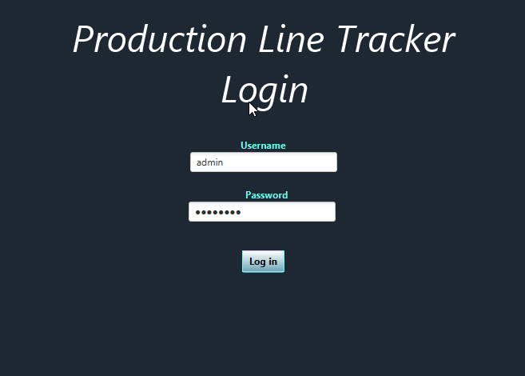
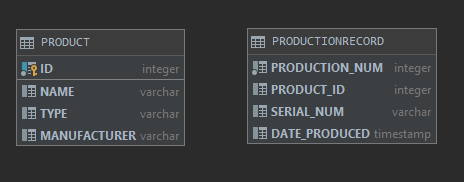
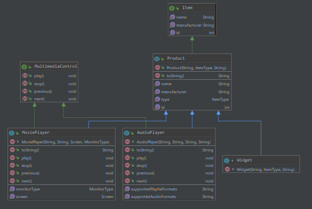
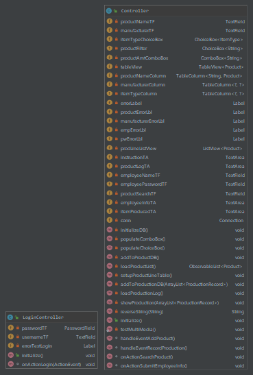
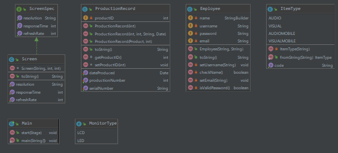

# Production Line Tracker

The Production Line Tracker is a program that will manage tracking inventory of what products are produced. This becomes essential for production workers because otherwise they will have to be physically producing items and write them down in a production log book. This program was made indiviually by Ramzy El-Taher, who has previously made different versions of the Production Line Tracker program in C++ and in Java. This project was started at August 19th as a semester long assignment for my Object Oriented Programming class at FGCU, and at this point of time, I have a decent amount of experience with Java, but no experience with JavaFX or databases. The project was finished in December of 2019, and refactorings were applied to it during the fall of 2020. The reason why I am making this is not only because it is an assignment, but it is also because working on projects like these are something that I am very passionate about and is enjoyable for me to work on daily.

## Demonstration

## Documentation

[Link to the website of the program generated with JavaDocs](https://reltaher.github.io/ProductionLineTracker-OOP-GUI-DB/index.html)

## Diagrams
Database Visualization Diagram:

[Sprint 1 Class Diagram](diagrams/Class_Diagram_Sprint1.pdf)

[Sprint 2 Class Diagram](diagrams/Class_Diagram_Sprint_2.pdf)

Final Sprint Class Diagrams:

## Getting Started

-Fork the repository by clicking on the "Fork" button on the top right.

-Clone the fork by clicking on "Clone or download"

-Make a pull request. I will have to accept it before you are able to start contributing or run the program yourself on your local machine.

Detailed guide provided here: https://guides.github.com/activities/forking/

## Built With

IntelliJ IDEA 2019.2

IntelliJ is a Java IDE built for professional developers. Some of the best features of IntelliJ includes giving relevant suggestions for each context, which includes code suggestions, refactoring tools, and shortcuts for code completion, such as a driver method for java (psvm -> tab) and the method to print to the console (sout -> tab).

## Contributing

There can always be additional features to add to this project. If you would like to contribute to this project, then create a pull request for this repository, and once accepted, pull this project into your IDE and add whatever you may feel is an improvement to the current version of this software. Once you finish, commit and push back into this repository.

## Author

Ramzy El-Taher

## License
[GNU General Public License v3.0](LICENSE)

## Acknowledgments

Prof. Vanselow: Cleared up confusion with program expectations for each sprint.

StackOverflow: Helped me with some Java syntax that I was struggling to find a solution for.

Software Engineering Fundamentals Team: Some of the team members has helped me implement some functionality thanks to their backend knowledge, such as filtering a search and creating a login scene.

## History

[Program History](program_history/README.md)

## Key Programming Concepts Utilized

-Using SceneBuilder to create a JavaFX GUI Structure

-Connecting to Database by registering JDBC driver, opening a connection, and executing a query using statements.

-Creating UML Diagrams within IntelliJ Ultimate Edition withing a package (Right Click Package -> Diagrams -> Show Diagram)

-Use of Enums (a fixed set of special objects, or constants), Abstract Classes (A class that cannot be used to make objects), and Interfaces (Similar to a contract).

-Inheritance, which is the idea of a subclass deriving fields and methods from a superclass.

-Polymorphism, which in biology is defined as an organism having many different forms and stages. This idea also applies on Object Oriented Programming, where a subclass can have its unique states and behavior compared to its superclass.
